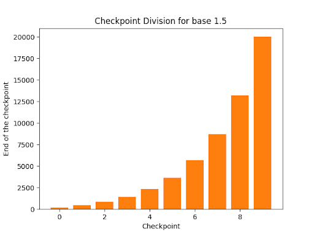

# Dynamic Algorithm Selection (DAS)

This project explores **Reinforcement Learning (RL)-based Meta-Black-Box Optimization**. It features an intelligent
agent that dynamically selects among several metaheuristics to maximize optimization performance.

---

## 📖 Overview

The system utilizes an **RL-based agent** to learn policies for **switching** between different optimizers during the
optimization process.

* **Diverse Portfolio:** Implements **eight metaheuristic algorithms**:
    * **LM-CMAES**, **Standard PSO**, **CPSO**, **IPSO**, **PSOL**, **OPOA2015**, **POWELL**, and **G3PCX**.
* **Unified Population:** All algorithms share the same **population size** (`n_individuals`), ensuring seamless
  transitions between solvers.
* **Quantized Switching:** The agent makes switching decisions in **quantized stages**.
    * The number of switches is defined by `n_checkpoints`.
    * The length of optimization episodes increases exponentially based on the Checkpoint Division Exponent (`cdb`).
* **Workflow:** The entry script, `main.py`, facilitates the training of the RL agent, followed by evaluation and
  comparison against individual sub-optimizers.

---

## 🏗 Features & Structure

| Component | Description |
| :--- | :--- |
| **RL Agent** | Learns dynamic optimizer selection policies. |
| **Metaheuristics** | A suite of solvers including LM-CMAES, PSO, IPSO, PSOL, CPSO, POWELL, OPOA2015, and G3PCX. |
| **Population Handling** | Shared `n_individuals` across all optimizers to maintain state consistency. |
| **Evaluation** | Benchmarks the trained RL model against standalone optimizers. |

---

## 💻 Command-Line Interface (CLI)

The project supports flexible configuration via command-line arguments.

### **Installation**

Install the project dependencies with a single command:

```bash
CFLAGS="-g -O3 -fPIC" uv sync

```

### **Usage**

To run the program, use the following command structure:

```bash
uv run das <name> [options]

```

### **Arguments**

| Argument                           | Type        | Default                     | Description                                                                                                      |
|------------------------------------|-------------|-----------------------------|------------------------------------------------------------------------------------------------------------------|
| `name`                             | `str`       | —                           | **Required.** Name tag for the run or experiment.                                                                |
| `-p`, `--portfolio`                | `list[str]` | `['SPSO', 'IPSO', 'SPSOL']` | Portfolio of sub-optimizers to include.                                                                          |
| `-m`, `--population_size`          | `int`       | `None`                      | Population size for all fixed-population optimizers. None means no fixed population size.                        |
| `-f`, `--fe_multiplier`            | `int`       | `10_000`                    | Function evaluation multiplier.                                                                                  |
| `-s`, `--n_checkpoints`            | `int`       | `10`                        | Number of checkpoints for sub-optimizer selection.                                                               |
| `-t`, `--test` / `--no-test`       | `bool`      | `True`                      | Whether to execute in test mode.                                                                                 |
| `-c`, `--compare` / `--no-compare` | `bool`      | `False`                     | Whether to compare results against standalone optimizers.                                                        |
| `-e`, `--wandb_entity`             | `str`       | `None`                      | Weights and Biases (WandB) entity name.                                                                          |
| `-w`, `--wandb_project`            | `str`       | `None`                      | Weights and Biases (WandB) project name.                                                                         |
| `-a`, `--agent`                    | `str`       | `policy-gradient`           | Agent type. Options: `neuroevolution`, `policy-gradient`, `random`, `RL-DAS`.                                    |
| `-l`, `--mode`                     | `str`       | `LOIO`                      | Train/Test split mode (see [Split Strategies](https://www.google.com/search?q=%23-train-test-split-strategies)). |
| `-x`, `--cdb`                      | `float`     | `1.0`                       | **Checkpoint Division Exponent**; determines how quickly checkpoint length increases.                            |
| `-r`, `--state-representation`     | `str`       | `ELA`                       | Method used to extract features from the algorithm population.                                                   |
| `-d`, `--force-restarts`           | `bool`      | `False`                     | Enable selection of forcibly restarting optimizers.                                                              |
| `-D`, `--dimensionality`           | `int`       | `None`                      | Dimensionality of problems.                                                                                      |
| `-E`, `--n_epochs`                 | `int`       | `1`                         | Number of training epochs.                                                                                       |
| `-O`, `--reward-option`            | `int`       | `1`                         | ID of method used to compute reward.                                                                             |

---

## 📊 Train-Test Split Strategies

The `-l` / `--mode` argument determines how the dataset is divided:

* **`LOIO` (Leave One Instance Out):** Uses  a randomly generated subset containing mixed problem types.
* **`hard` (Leave One Problem Out):** Splits the dataset by grouping identical problem instances. Contains **twice as
  many** training functions as test functions.
* **`easy` (Leave One Problem Out):** Similar to `hard`, but with **inverted** train-test proportions (more test
  functions).
* **`CV-LOIO`:** Splits problems into 4 folds and performs Cross-Validation using *Leave One Instance Out*.
* **`CV-LOPO`:** Splits problems into 4 folds and performs Cross-Validation using *Leave One Problem Out*.

> **Note:** The portfolio can also be examined for each standalone algorithm via `baselines` mode.

---

## 📏 Checkpoint Division Base (CDB)

The `-x` / `--cdb` argument controls the **pacing** of the optimization process by determining how the total budget of function evaluations is distributed across checkpoints.

The duration of these periods follows an exponential curve defined by the base *x* (the `cdb` value). This allows for dynamic adjustment of how much time the agent spends in specific stages of optimization.

### Visual Comparison

Below is a comparison of how the checkpoint lengths correspond to different `cdb` values.

|  **Uniform Distribution (`cdb = 1.0`)**  |   **Exponential Growth (`cdb > 1.0`)**   |
|:----------------------------------------:|:----------------------------------------:|
|  |  |
|        *Fixed interval lengths.*         |    *Intervals grow longer over time.*    |

### Analysis

* **Uniform (`cdb = 1.0`):**
    When the base is set to **1.0**, every checkpoint has the exact same duration (number of function evaluations). This is useful for consistent monitoring and gives the agent equal opportunities to switch algorithms throughout the entire run.

* **Growing (`cdb > 1.0`):**
    When the base is **greater than 1.0**, the checkpoints start very short and grow exponentially longer.
    * **Early Stages (Short):** Allows the agent to make rapid decisions and switch algorithms frequently during the initial exploration phase.
    * **Later Stages (Long):** Provides longer uninterrupted periods for algorithms to converge (exploitation) without being disrupted by frequent agent switching.

## 🏆 Reward Options

The `-O` or `--reward-option` argument determines how the agent calculates the reward after each checkpoint. All options compute an `improvement` metric based on the change in the best objective value (`y`), scaled against the initial value range (`initial_value_range[1] - initial_value_range[0]`).

Here are the available reward strategies:

* **Option 1 (`1`): Logarithmic Scaled Improvement**
Calculates the improvement between the current checkpoint and the previous one (`old_best_y - new_best_y`), scales it, clips the value between 0.0 and 1.0, and applies a logarithmic transformation (`np.log(reward + 1e-5)`). Useful for smoothing out large variance in improvements.
* **Option 2 (`2`): Linear Clipped Improvement**
Calculates the scaled improvement between the current checkpoint and the previous one (`old_best_y - new_best_y`), and simply clips the result between 0.0 and 1.0 without any logarithmic scaling (`np.clip(reward, 0.0, 1.0)`).
* **Option 3 (`3`): Sparse Total Improvement (Final Checkpoint Only)**
Provides a sparse reward. It returns `0.0` for all intermediate checkpoints. At the final checkpoint, it calculates the *total* improvement from the very start of the optimization run (`initial_value_range[0] - new_best_y`), scales it, and applies a logarithmic transformation.
* **Option 4 (`4`): Binary Threshold Reward**
Calculates the scaled improvement between checkpoints and provides a binary outcome: it returns `1.0` if the scaled improvement is greater than or equal to a minimum threshold (`1e-3`), and `0.0` otherwise.


## 🧠 State Representation

There are three options for representing the optimization state (`-r` flag):

1. **`ELA` (Exploratory Landscape Analysis):**
   Implemented using [pflacco](https://pflacco.readthedocs.io/en/latest/index.html). Uses a subset of features to manage
   computational complexity.
2. **`NeurELA`:**
   Uses a pre-trained model for feature extraction. The implementation is
   available [here](https://github.com/MetaEvo/Neur-ELA) and described in
   this [paper](https://arxiv.org/pdf/2408.10672).
3. **`custom`:**
   A proposed feature extraction method
   implemented [here](https://www.google.com/search?q=dynamicalgorithmselection/agents/agent_state.py%2349). This can be
   modified to include additional features.

---

## 🤝 Acknowledgment

* Much of the optimizer implementation is adapted from:
  🔗 [Evolutionary-Intelligence/pypop](https://github.com/Evolutionary-Intelligence/pypop/tree/main)
* A substantial part of this work is inspired by the research of:
  🔗 [MetaEvolution Lab](https://metaevo.github.io/)

---

## 🚀 Roadmap / To-Do

* [ ] Add more sub-optimizers.
* [ ] Enable additional parameters specifying the agent's model architecture and behavior.